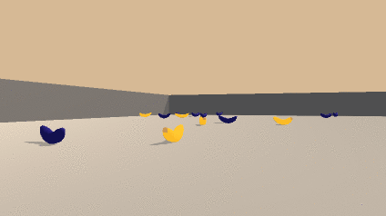
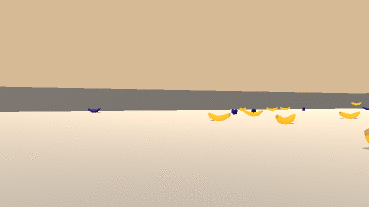

# Project 1: Navigation

### Introduction

For this project, I will train an agent to navigate (and collect bananas!) in a large, square world.  

A reward of +1 is provided for collecting a yellow banana, and a reward of -1 is provided for collecting a blue banana.  Thus, the goal of the agent is to collect as many yellow bananas as possible while avoiding blue bananas.  

The state space has 37 dimensions and contains the agent's velocity, along with ray-based perception of objects around agent's forward direction.  Given this information, the agent has to learn how to best select actions.  Four discrete actions are available, corresponding to:
- **`0`** - move forward.
- **`1`** - move backward.
- **`2`** - turn left.
- **`3`** - turn right.

The task is episodic, and in order to solve the environment, the agent must get an average score of +13 within 2000 consecutive episodes.

### Methodology
The agent which used to collect banana will be trained by one of the Deep Reinformcement Learning Methodology, Deep Reinforcement Network. With proper Deep Reinforcement Network training, the agent will be able to successfully navigate, aim for more yellow banana and avoid stepping into blue banana.

Before training

After training

### Environment
The environment contains 
1. a navigation game based on Unity engine, which is built by Udacity Deep Reinforcement Learning team as part of the course material. The file can be downloaded from below links.

- Linux: [click here](https://s3-us-west-1.amazonaws.com/udacity-drlnd/P1/Banana/VisualBanana_Linux.zip)
- Mac OSX: [click here](https://s3-us-west-1.amazonaws.com/udacity-drlnd/P1/Banana/VisualBanana.app.zip)
- Windows (32-bit): [click here](https://s3-us-west-1.amazonaws.com/udacity-drlnd/P1/Banana/VisualBanana_Windows_x86.zip)
- Windows (64-bit): [click here](https://s3-us-west-1.amazonaws.com/udacity-drlnd/P1/Banana/VisualBanana_Windows_x86_64.zip)

2. The Navigation notebook covers the steps on how to train the agent and test the agent to achieve the score of 13+ yellow bananas.

3. The codes required to train the agent, i.e. dqn_agent.py and model.py

4. python 3.6.8 with dependency on pytorch, matplotlib, numpy .... etc.

### Getting Started

Download the above banana zip file and pasted it to under the same directory of `Navigation.ipynb`, follow the instructions listed on Navigation.ipnyb.
